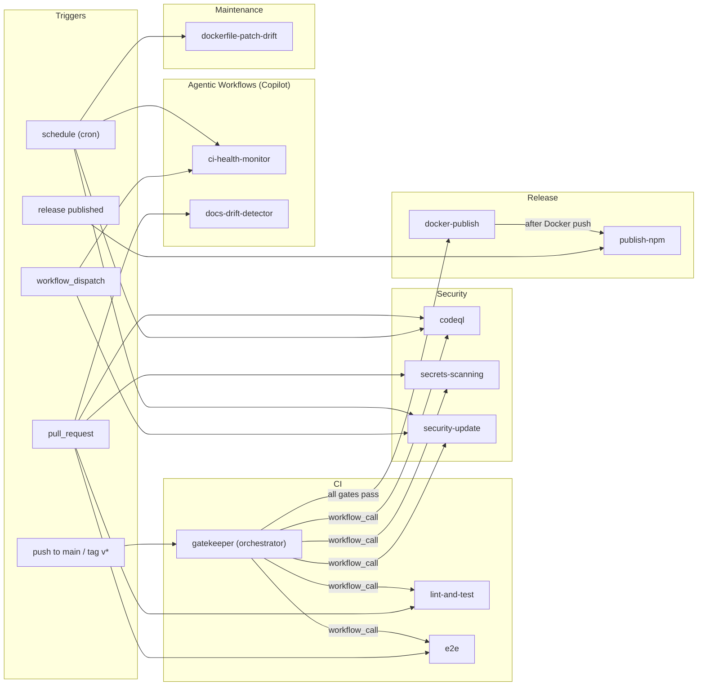

# CI/CD Workflows

This directory contains all GitHub Actions workflows for the **db-mcp** project. The pipeline is organized into three layers: continuous integration, security scanning, and automated release/publishing.

## Workflow Map



---

## Workflows

### CI / Orchestration

| File                                                   | Trigger                        | Purpose                                                                                 |
| ------------------------------------------------------ | ------------------------------ | --------------------------------------------------------------------------------------- |
| [gatekeeper.yml](gatekeeper.yml)                       | push to `main` / tag `v*`      | Orchestrates CI/CD: fans out lint + security scans, gates docker-publish on all passing |
| [lint-and-test.yml](lint-and-test.yml)                 | PR to `main` / `workflow_call` | Lint, typecheck, build, unit tests (Node 24.x + 25.x matrix), npm audit                 |
| [e2e.yml](e2e.yml)                                     | PR to `main` / `workflow_call` | End-to-end tests via Playwright                                                         |

### Security

| File                                         | Trigger                                           | Purpose                                                                                            |
| -------------------------------------------- | ------------------------------------------------- | -------------------------------------------------------------------------------------------------- |
| [codeql.yml](codeql.yml)                     | PR / weekly / `workflow_call`                     | CodeQL static analysis for `javascript-typescript` and `actions`                                   |
| [secrets-scanning.yml](secrets-scanning.yml) | PR / `workflow_call`                              | TruffleHog (verified secrets) + Gitleaks scanning                                                  |
| [security-update.yml](security-update.yml)   | weekly / manual / `workflow_call`                 | Docker image Trivy scan (CRITICAL/HIGH/MEDIUM), SARIF upload, auto-creates GitHub issue on failure |

### Release & Publishing

| File                                     | Trigger                                                          | Purpose                                                                                                   |
| ---------------------------------------- | ---------------------------------------------------------------- | --------------------------------------------------------------------------------------------------------- |
| [publish-npm.yml](publish-npm.yml)       | release published / manual / `workflow_call` from docker-publish | Publishes to npm with version verification                                                                |
| [docker-publish.yml](docker-publish.yml) | `workflow_call` from gatekeeper (after all security gates pass)  | Multi-arch Docker build (amd64 + arm64), Docker Scout scan, manifest merge, Docker Hub description update |

### Maintenance

| File                                                     | Trigger              | Purpose                                                                   |
| -------------------------------------------------------- | -------------------- | ------------------------------------------------------------------------- |
| [dockerfile-patch-drift.yml](dockerfile-patch-drift.yml) | schedule             | Detects out-of-sync Dockerfile versions between testing and production    |

### Agentic Workflows (GitHub Copilot)

These are AI-powered workflows using [GitHub Copilot Coding Agent](https://docs.github.com/en/copilot/using-github-copilot/using-copilot-coding-agent-to-work-on-tasks/about-assigning-tasks-to-copilot). Each `.md` file contains the agent prompt; the corresponding `.lock.yml` is the auto-generated compiled workflow (**do not edit `.lock.yml` files**).

| Prompt                                               | Lock File                                                    | Schedule             | Purpose                                                                                  |
| ---------------------------------------------------- | ------------------------------------------------------------ | -------------------- | ---------------------------------------------------------------------------------------- |
| [ci-health-monitor.md](ci-health-monitor.md)         | [ci-health-monitor.lock.yml](ci-health-monitor.lock.yml)     | Wed 14:00 UTC        | Audits workflows for deprecated actions, Node.js runtime issues, stale Dependabot config |
| [docs-drift-detector.md](docs-drift-detector.md)     | [docs-drift-detector.lock.yml](docs-drift-detector.lock.yml) | PR (on code changes) | Audits README, DOCKER_README, CONTRIBUTING for drift against code changes                |

---

## Release Pipeline

The full release flow for pushes to `main` (including dependency updates):

```
push to main / tag v*
  → gatekeeper (orchestrator)
      ├── lint-and-test  ──┐
      ├── e2e              │
      ├── codeql           ├── all must pass
      ├── secrets-scanning ┤
      └── security-update ─┘
            ↓ all gates pass
          docker-publish (multi-arch build + Docker Scout + npm publish)
```

For manual feature releases, the maintainer runs `/bump-deploy` locally which pushes a tag, triggering the gatekeeper pipeline.

---

## Secrets Required

| Secret            | Used By                                             | Purpose                        |
| ----------------- | --------------------------------------------------- | ------------------------------ |
| `GITHUB_TOKEN`    | auto-release, security-update, agentics-maintenance | Git operations, issue creation |
| `NPM_TOKEN`       | publish-npm                                         | npm registry authentication    |
| `DOCKER_USERNAME` | docker-publish                                      | Docker Hub login               |
| `DOCKER_PASSWORD` | docker-publish                                      | Docker Hub login               |

---

## Editing Guidelines

- **YAML workflows** — edit directly, commit to `main` or via PR
- **Agentic `.md` prompts** — edit the `.md` file, then run `gh aw compile` to regenerate the `.lock.yml`
- **`.lock.yml` files** — **never edit manually**; always regenerate via `gh aw compile`
